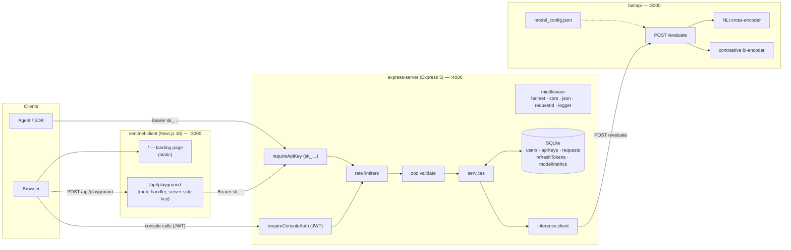
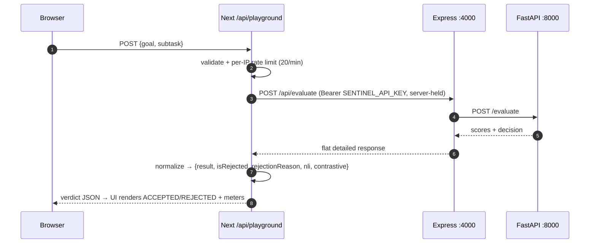
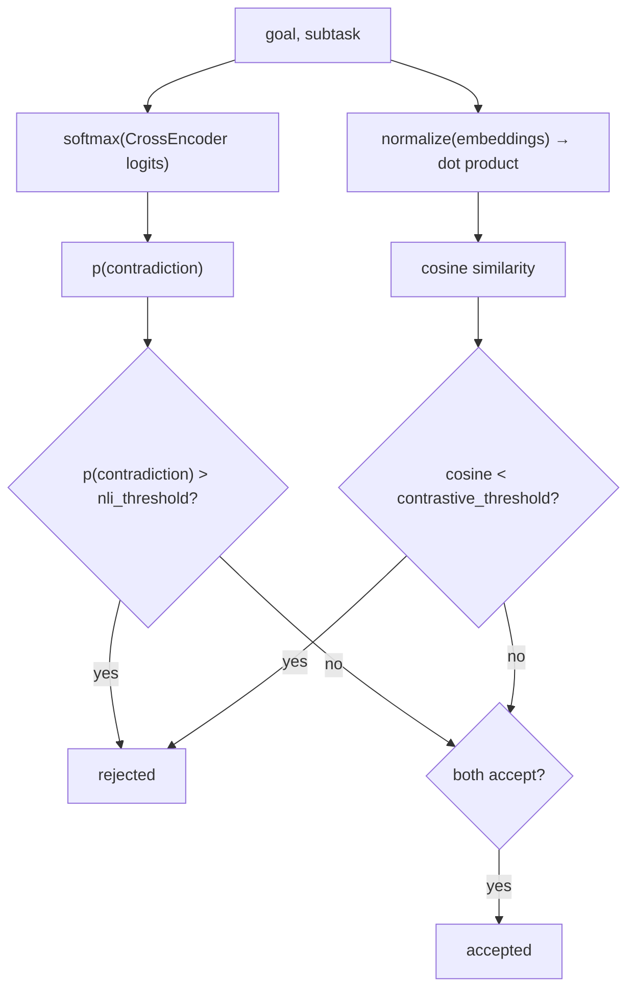
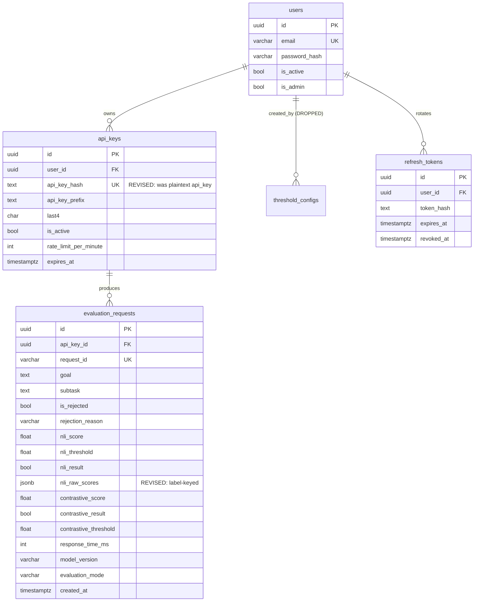

# Sentinel — System Architecture & Pipeline

> **Status:** describes the system **as built today** (commit `c4161dd`), plus the deltas from the
> original spec. Everything below is verified against the code in this repo.
>
> **Companion docs:** [`full_plan.md`](./full_plan.md) (original thesis spec) ·
> [`sentinel-client/plan.md`](./sentinel-client/plan.md) ·
> [`express-server/plan.md`](./express-server/plan.md) + [`express-server/API.md`](./express-server/API.md) ·
> [`fastapi/plan.md`](./fastapi/plan.md) + [`fastapi/README.md`](./fastapi/README.md)
>
> **For chart generation:** §3 (top-level flow), §7 (pipelines), §8 (inference decision) each carry a
> Mermaid diagram **and** a plain node/edge list. §14 is a single machine-readable graph spec.

---

## Table of contents

1. [What the system does](#1-what-the-system-does)
2. [Actors and trust boundaries](#2-actors-and-trust-boundaries)
3. [Top-level architecture](#3-top-level-architecture)
4. [Runtime topology](#4-runtime-topology)
5. [Component inventory](#5-component-inventory)
6. [API surface](#6-api-surface)
7. [Pipelines](#7-pipelines)
8. [Inference internals](#8-inference-internals)
9. [Data model](#9-data-model)
10. [Security model](#10-security-model)
11. [Configuration matrix](#11-configuration-matrix)
12. [Current vs. planned](#12-current-vs-planned)
13. [Gaps and next steps](#13-gaps-and-next-steps)
14. [Machine-readable graph spec](#14-machine-readable-graph-spec)

---

## 1. What the system does

Sentinel is a **security gateway for autonomous agents**. Before an agent performs a subtask, it
submits the subtask (and the goal it was authorized to pursue) to Sentinel. Two independently
fine-tuned MiniLM models each score the pair, and **if either model rejects, the subtask is
blocked**. Every decision is logged with the scores that produced it.

- **NLI cross-encoder** — does the subtask *contradict* the authorized goal?
- **Contrastive bi-encoder** — is the subtask *semantically close* to the goal?
- **Overall rule:** `reject if EITHER model rejects`.

Three deployable pieces:

| Piece | Role | Stack |
| --- | --- | --- |
| `sentinel-client` | Marketing site + operator console | Next.js 16 (App Router), React 19, Tailwind v4, daisyUI 5 |
| `express-server` | API gateway: auth, API keys, rate limits, logging, stats, inference proxy | Node 25, Express 5 (CommonJS) |
| `fastapi` | Model inference service (the only place models run) | Python 3.12, FastAPI, sentence-transformers 5.5.0, torch 2.14 |

---

## 2. Actors and trust boundaries

| Actor | Plane | Credential | Reaches |
| --- | --- | --- | --- |
| **Agent / SDK** (machine client) | **Data plane** | API key `sk_test_…` / `sk_live_…` | `POST /api/evaluate` only |
| **Operator** (human, via console) | **Console plane** | JWT access token (Bearer) | `/api/auth/*`, `/api/keys/*`, `/api/requests*`, `/api/stats/*`, `/api/models`, `/api/metrics`, `/api/evaluate/preview` |
| **Anonymous visitor** | Public | none | `GET /`, `POST /api/playground` (server-side key) |

**Trust boundaries**

1. **Browser → Next server**: no credential crosses this line. The playground's API key lives in the
   Next server's environment (`SENTINEL_API_KEY`), never in client JS.
2. **Next server → Express**: Bearer API key (server-held).
3. **Express → FastAPI**: unauthenticated, network-local. FastAPI is assumed reachable only from
   Express (bind to localhost / private network).
4. **Express → data store**: a local SQLite database (file-backed, `better-sqlite3`); the seam is `src/store/index.js`.

---

## 3. Top-level architecture



**Node/edge list**

- `BR → LAND` : browser loads the public landing page (hero, features, playground UI)
- `BR → PGROUTE` : playground form posts `{goal, subtask}`
- `PGROUTE → APIKEY` : server-side proxy attaches the server-held API key
- `AG → APIKEY` : agent calls `POST /api/evaluate` with its own API key
- `BR → AUTHZ` : console pages call with the access JWT
- `APIKEY → RATE → VAL → SVC` : data-plane request path
- `SVC ↔ STORE` : reads/writes users, keys, evaluation logs, refresh tokens, counters
- `SVC → INF → EVAL` : gateway proxies inference
- `EVAL → NLI`, `EVAL → CON` : both models run per request (concurrently)
- `CFG ⇢ EVAL` : model dirs + thresholds loaded from `model_config.json`

---

## 4. Runtime topology

| Process | Port | Start command | Notes |
| --- | --- | --- | --- |
| Next.js console | `3000` | `cd sentinel-client && ./run.sh` / `npm run dev` | Serves `/` and `/api/playground` |
| Express gateway | `4000` | `cd express-server && ./run.sh` / `npm start` | Deliberately not 3000 (console owns it) |
| FastAPI inference | `8000` | `cd fastapi && ./run.sh` | Loads both models + warms up at startup |

Both services ship `run.sh` (bash) and `run.ps1` (PowerShell) that create the venv / install deps on
first run. `.gitattributes` pins `*.sh` to LF.

**Dependency direction:** `client → express → fastapi`. FastAPI has no knowledge of the gateway.
Express degrades to **mock inference** when FastAPI is down (`INFERENCE_MOCK=true`).

---

## 5. Component inventory

### 5.1 `sentinel-client` (Next.js)

```
app/
  layout.tsx                 root layout: fonts (DM Serif Display · Space Grotesk · Geist Mono, via next/font)
  globals.css                custom daisyUI theme "sentinel" + @theme tokens + .bg-hatch, .label-mono
  page.tsx                   landing page: hero · request/response panel · capabilities · how-it-works · playground · API · CTA
  api/playground/route.ts    server-side proxy → Express POST /api/evaluate
components/
  site-header.tsx            sticky navbar: sign-in state / profile dropdown / mobile panel
  site-footer.tsx            footer columns + mono meta
  playground.tsx             client: goal+subtask inputs, 3 presets, "Try it out", verdict + per-model meters
  ui/button.tsx              Button / ButtonLink (primary | outline | ghost)
  ui/eyebrow.tsx             small uppercase section label
lib/cn.ts                    class-name joiner
```

**Design system:** strictly monochrome, outline-driven white theme. Titles **DM Serif Display**,
body **Space Grotesk**, labels/data **Geist Mono**. Division is by 1px hairlines, never fills or
shadows. `.bg-hatch` (45° repeating hairline) is the page base texture; the `max-w-6xl` content
column paints `bg-paper` on top so it reads as the focal panel.

### 5.2 `express-server` (Express 5, CommonJS)

```
src/
  server.js                 bootstrap: store → app → listen → dev seed → SIGINT/SIGTERM
  app.js                    app factory: helmet, cors, json(100kb), requestId, accessLog, routes, 404, errorHandler
  seed.js                   dev-only demo user + API key (key pinnable via SEED_DEMO_API_KEY)
  config/env.js             env loading (process.loadEnvFile) + defaults + validation
  lib/                      errors (AppError + code→status map), crypto (key gen/sha256), jwt,
                            password (scrypt), csv, logger (JSON lines)
  middleware/               requestId, logger, validate (zod→req.validated), requireConsoleAuth,
                            requireApiKey, rateLimit (per-key/per-IP/per-user), notFound, errorHandler
  schemas/                  zod: auth, keys, evaluate, requests, stats, common
  services/                 auth · keys · inference.client · evaluation · requests · stats · models
  store/                    index.js (builds store) · sqlite.js (schema + repos)
  routes/                   auth, keys, evaluate, requests, stats, models, health + index (mounts)
```

**Layering rule:** `route → service → store`. Controllers are thin; validation happens in
middleware; errors are thrown as `AppError` and rendered by one handler (Express 5 forwards async
rejections automatically).

### 5.3 `fastapi` (inference)

```
app/
  main.py                   FastAPI app + lifespan (load models, build cache + semaphore)
  config.py                 env settings (pydantic-settings) + model_config.json loader
  models.py                 load CrossEncoder + SentenceTransformer; base-model fallback; warm-up
  preprocess.py             training-parity text formatting (format_nli, format_document)
  service.py                pure logic: softmax, evaluate_nli, evaluate_contrastive, combine, build_result
  schemas.py                pydantic request/response models (also the OpenAPI doc)
  cache.py                  thread-safe LRU cache
  routers/                  health.py · models_info.py · evaluate.py
tests/                      test_preprocess.py · test_service.py  (14 tests)
model_config.json           model dirs, versions, thresholds, decision rules
old-training/               the scripts that produced the checkpoints
.models/                    fine-tuned checkpoints (weights git-ignored)
```

---

## 6. API surface

### 6.1 Express gateway (`:4000`)

**Envelope:** console endpoints return `{ data, meta? }`; errors return
`{ error: { code, message, details? } }`. **`POST /api/evaluate` is the exception** — it returns the
spec's flat shape.

| Method | Path | Auth | Purpose |
| --- | --- | --- | --- |
| GET | `/healthz` | none | Liveness |
| GET | `/readyz` | none | Readiness (probes inference) |
| POST | `/api/auth/register` | none | Create account → tokens |
| POST | `/api/auth/login` | none | Login → tokens |
| POST | `/api/auth/refresh` | refresh token | Rotate tokens |
| GET | `/api/auth/me` | JWT | Current user |
| POST | `/api/auth/logout` | JWT | Revoke refresh token |
| GET | `/api/keys` | JWT | List keys (masked) |
| POST | `/api/keys` | JWT | Create key (**plaintext returned once**) |
| GET | `/api/keys/:id` | JWT | Key detail |
| PATCH | `/api/keys/:id` | JWT | Activate / deactivate / rename |
| DELETE | `/api/keys/:id` | JWT | Delete key |
| POST | `/api/evaluate` | **API key** | Evaluate goal+subtask (flat response) |
| POST | `/api/evaluate/preview` | JWT | Evaluate with threshold override (**not logged**) |
| GET | `/api/requests` | JWT | Filterable, paginated logs |
| GET | `/api/requests/:requestId` | JWT | Evaluation detail |
| GET | `/api/requests/export.csv` | JWT | CSV export |
| GET | `/api/stats/summary` | JWT | Dashboard metrics |
| GET | `/api/stats/recent` | JWT | Recent activity feed |
| GET | `/api/models` | JWT | Read-only model info (proxied) |
| GET | `/api/metrics` | JWT | In-process model counters |

Full request/response shapes: [`express-server/API.md`](./express-server/API.md).

### 6.2 FastAPI inference (`:8000`)

| Method | Path | Purpose |
| --- | --- | --- |
| GET | `/health` | Loaded models + versions + device (503 until ready) |
| GET | `/models` | Read-only model info (versions, thresholds, metrics) |
| POST | `/evaluate` | Run both models → per-model scores + combined decision |
| GET | `/docs` | Swagger UI |

### 6.3 Next.js (`:3000`)

| Method | Path | Purpose |
| --- | --- | --- |
| GET | `/` | Landing page (static) |
| GET | `/docs` | **Public API reference + tutorials** (`app/docs`) |
| GET | `/login` | Auth surface — sign in / create account (`(auth)` group) |
| GET | `/dashboard` | Console home (`(app)` group; session required) |
| GET | `/api-keys` · `/logs` · `/settings` | Console routes (`(app)` group; placeholders) |
| GET | `/api/auth/refresh` | Rotates the session token pair (Route Handler) |
| POST | `/api/playground` | Public playground proxy → Express `/api/evaluate` |

---

## 7. Pipelines

### 7.1 P1 — Evaluation (data plane) — the core pipeline

```mermaid
sequenceDiagram
  autonumber
  participant A as Agent / SDK
  participant E as Express :4000
  participant S as Store (SQLite)
  participant F as FastAPI :8000
  participant M as Models

  A->>E: POST /api/evaluate {goal, subtask, mode} + Bearer sk_…
  E->>E: requireApiKey → sha256 lookup, active? expired?
  E->>E: rate limit (per API key)
  E->>E: zod validate (goal, subtask ≤2000, mode)
  E->>F: POST /evaluate {goal, subtask} (timeout 5s, 1 retry)
  F->>F: preprocess (NLI templates / contrastive framing)
  par both models
    F->>M: CrossEncoder.predict(premise, hypothesis)
    and
    F->>M: SentenceTransformer.encode(goal side, subtask side)
  end
  M-->>F: logits / embeddings
  F->>F: softmax → p(contradiction); cosine similarity
  F->>F: reject if p(contra) > t_nli OR cosine < t_con
  F-->>E: {nli:{score,rejected,threshold,raw_scores}, contrastive:{…}, is_rejected, rejection_reason, model_version}
  E->>S: insert evaluation_requests + bump model_metrics
  E-->>A: mode=standard → {result, date, id}
  Note over E,A: mode=detailed adds {nli:{score,result,threshold}, contrastive:{…}}
```

**Steps**

| # | Stage | Where | Fails with |
| --- | --- | --- | --- |
| 1 | API-key auth (sha256 hash lookup, `is_active`, `expires_at`) | Express middleware | 401 / 403 |
| 2 | Per-key rate limit | Express middleware | 429 |
| 3 | Body validation (zod) | Express middleware | 400 `VALIDATION_ERROR` |
| 4 | Inference call (+ timeout, 1 retry) | `inference.client` | 503 `INFERENCE_UNAVAILABLE` |
| 5 | Preprocess → NLI + contrastive (concurrent) | FastAPI | 500 / 503 |
| 6 | Decision (OR of both models) | FastAPI `service.combine_decisions` | — |
| 7 | Persist log + metrics (best-effort) | Express `evaluation.service` | non-blocking |
| 8 | Shape response by `mode` | Express route | — |

**Timing note:** `response_time_ms` measures **step 4 only** (upstream inference), not the whole
request.

### 7.2 P2 — Playground (public demo)



**Why a proxy:** the gateway requires an API key; a browser must never hold one. The key is read
from `SENTINEL_API_KEY` on the Next server only.

### 7.3 P3 — Operator authentication

```mermaid
sequenceDiagram
  autonumber
  participant C as Console
  participant E as Express
  participant S as Store

  C->>E: POST /api/auth/register {email, password, fullName}
  E->>E: zod validate; scrypt-hash password; unique email check
  E->>S: create user
  E-->>C: 201 {user, accessToken, refreshToken}
  Note over C,E: login → verify scrypt hash → same token pair

  C->>E: POST /api/auth/refresh {refreshToken}
  E->>S: look up jti; revoked? hash matches? expired?
  E->>S: revoke old jti (rotation)
  E-->>C: {accessToken, refreshToken}
```

- **Access token**: HS256, `typ: "access"`, TTL `JWT_ACCESS_TTL` (default `1h`).
- **Refresh token**: `typ: "refresh"` + `jti`, TTL `JWT_REFRESH_TTL` (default `7d`), **rotated on
  every use** and revocable server-side.
- Passwords: **scrypt** (Node built-in, no native build).

### 7.4 P4 — Console reads

| Flow | Path | Notes |
| --- | --- | --- |
| Logs list | `GET /api/requests` → `requests.service.list` → store | filters: `from,to,status,q,mode,page,pageSize,sort` |
| Log detail | `GET /api/requests/:requestId` | scoped to the caller's own records (404 otherwise) |
| CSV export | `GET /api/requests/export.csv` | same filters, no pagination; 15 columns |
| Stats | `GET /api/stats/summary` / `/recent` | aggregate over `createdAt` window |
| Model info | `GET /api/models` → `models.service.fetchModels` → **FastAPI `/models`** | falls back to last-known with `stale: true` |
| Metrics | `GET /api/metrics` | in-process counters |

---

## 8. Inference internals

### 8.1 Preprocessing (must match training exactly)

| Model | Input construction |
| --- | --- |
| **NLI** | `premise = "An AI agent is authorized to {goal.lower()}. The agent performs only tasks that support this goal."`<br/>`hypothesis = "The agent is now performing: {subtask.lower()}"` |
| **Contrastive** | goal side `= "Goal: {goal}. Subtask: {goal}."`<br/>subtask side `= "Goal: {goal}. Subtask: {subtask}."` (the **`-raw-`** variant; no decomposition) |

### 8.2 Decision logic



| Model | Score | Reject when | Notes |
| --- | --- | --- | --- |
| **NLI** `cross-encoder/nli-MiniLM2-L6-H768` | `p(contradiction)` ∈ [0,1] | `score > threshold` | label order **`[contradiction, entailment, neutral]`** — contradiction is index **0**; checkpoint has `activation_fn = Identity`, so **softmax is applied by us** |
| **Contrastive** `all-MiniLM-L12-v2` | cosine ∈ [−1,1] | `score < threshold` | framed template on **both** sides; mean pooling + normalize |

**`rejection_reason`** ∈ `accepted` | `nli_reject` | `contrastive_reject` | `both_reject`.

**Artifacts**

| Artifact | Path |
| --- | --- |
| NLI (final) | `fastapi/.models/sentinelagent_nli_finetuned/` |
| Contrastive (final) | `fastapi/.models/contrastive-miniLM-e4-b16-lr1e-05-mn6-raw-vs0.2/` |
| Contrastive folds | `…/fold_0..4/` (evaluation only) |
| Config | `fastapi/model_config.json` |

> ⚠️ **Thresholds in `model_config.json` are placeholders (`0.5`)** until training emits
> `logs/nli_cv_results.json` / `logs/contrastive_cv_results.json`. The NLI script now emits a
> `recommended_nli_threshold` (mean of per-fold F1-optimal cut-offs).

**Fallback:** if a fine-tuned dir is missing, FastAPI loads the base pretrained model and reports
`on_base_models: true`. If the inference service is unreachable, Express can fall back to
deterministic mock scores when `INFERENCE_MOCK` / `INFERENCE_MOCK_FALLBACK` are set
(`model_version: "mock"`).

---

## 9. Data model

### 9.1 Store — local SQLite (`express-server/src/store/sqlite.js`)

Everything below is a JS object shape returned by the store. `createStore()` (in
`store/index.js`) opens one SQLite file via `better-sqlite3` (synchronous) and
returns these repositories; `store/sqlite.js` holds the DDL + queries.

```
users           { id, email, username, fullName, passwordHash, isActive, isAdmin,
                  lastLoginAt, createdAt, updatedAt }
apiKeys         { id, userId, keyName, apiKeyHash, apiKeyPrefix, last4, isActive,
                  rateLimitPerMinute, createdAt, lastUsedAt, expiresAt }
requests        { id, userId, apiKeyId, requestId, goal, subtask,
                  isRejected, rejectionReason,
                  nliScore, nliResult, nliThreshold, nliRawScores,
                  contrastiveScore, contrastiveResult, contrastiveThreshold,
                  responseTimeMs, modelVersion, evaluationMode, userAgent, createdAt }
refreshTokens   { jti, userId, tokenHash, expiresAt, revokedAt, createdAt }
modelMetrics    { modelType, evaluationCount, rejectionCount, avgScore,
                  avgResponseTimeMs, lastUpdated }
```

**Everything persists across restarts** in one local SQLite file (`env.dbPath`,
default `express-server/data/sentinel.db`; WAL mode, foreign keys on). `users.email`
is `COLLATE NOCASE UNIQUE` and `api_keys.api_key_hash` is unique. The DB file and
its `-wal`/`-shm` sidecars are git-ignored.

### 9.2 Relational schema — SQLite (from `full_plan.md`, with revisions)

SQLite is dynamically typed, so the type names below map to storage classes:
`uuid`/`varchar`/`text`/`char`/`timestamptz` → **TEXT** (ISO-8601 for timestamps),
`bool` → **INTEGER** `0`/`1` (mapped back to JS booleans by the store), `float` →
**REAL**, `int` → **INTEGER**, `jsonb` → **TEXT** (JSON string). The `users`,
`api_keys`, `evaluation_requests`, `refresh_tokens` and `model_metrics` tables are
confirmed implemented in `store/sqlite.js` (no `threshold_configs`).



**Revisions vs. `full_plan.md`**

- `api_keys.api_key` (plaintext) → **`api_key_hash` + `api_key_prefix` + `last4`**.
- `threshold_configs` → **dropped**. Thresholds are training artifacts, exposed read-only via
  `GET /api/models`; the console-only `/api/evaluate/preview` accepts experimental overrides.
- `evaluation_requests.nli_raw_scores` → stored **keyed by label** (`contradiction`, `entailment`,
  `neutral`), not the spec's positional `[entailment, neutral, contradiction]`.
- `refresh_tokens` → added (the spec had no refresh-token store).
- `model_metrics` → retained.

---

## 10. Security model

| Concern | Implementation |
| --- | --- |
| API keys | `sk_test_`/`sk_live_` + 32 base62 chars; stored as **sha256**; plaintext shown **once** at creation; `last_used_at` updated on use |
| Passwords | **scrypt** (`N=16384, r=8, p=1`), random 16-byte salt, constant-time compare |
| Console sessions | HS256 JWT access (short TTL) + rotating refresh token; `JWT_SECRET` required in production |
| Ownership | Every console read/write is scoped to `req.user.id`; cross-user access returns **404** (not 403) |
| Rate limits | auth `10/min` per IP · evaluate per-key (`rateLimitPerMinute`) · console `600/min` per user · playground `20/min` per IP |
| Headers | `helmet`; CORS allowlist (`CORS_ORIGINS`) |
| Body size | `express.json({ limit: '100kb' })` |
| Upstream | 5s timeout + 1 retry; malformed upstream payload → `INFERENCE_BAD_RESPONSE` |
| Log hygiene | Access logs contain no headers, bodies, tokens or keys |
| Error messages | `401`/`403` stay generic; 5xx messages hidden in production |
| Secrets in browser | **None** — the playground key stays server-side |

---

## 11. Configuration matrix

### `express-server` (`.env`)

| Variable | Default | Purpose |
| --- | --- | --- |
| `NODE_ENV` | `development` | `production` tightens behaviour |
| `PORT` | `4000` | HTTP port |
| `CORS_ORIGINS` | `http://localhost:3000` | Allowed browser origins |
| `JWT_SECRET` | dev: random | **Required in production** |
| `JWT_ACCESS_TTL` / `JWT_REFRESH_TTL` | `1h` / `7d` | Token lifetimes |
| `INFERENCE_URL` | `http://localhost:8000` | FastAPI base URL |
| `INFERENCE_TIMEOUT_MS` | `5000` | Upstream timeout |
| `INFERENCE_MOCK` | `false` | Skip FastAPI, synthesize scores |
| `INFERENCE_MOCK_FALLBACK` | `false` | Degrade to mock on connection failure |
| `API_KEY_PREFIX` | `sk_test_`/`sk_live_` | Key prefix |
| `RATE_LIMIT_DEFAULT_PER_MIN` | `60` | Default per-key limit |
| `DB_PATH` | `data/sentinel.db` | SQLite file for the whole store; `:memory:` = ephemeral |
| `SEED_DEMO` | `true` (non-prod) | Seed demo user + key at startup |
| `SEED_DEMO_API_KEY` | — | Pin the seeded key (stable across restarts) |

### `fastapi` (environment)

| Variable | Default | Purpose |
| --- | --- | --- |
| `MODELS_DIR` | `fastapi/.models` | Where model folders live |
| `MODEL_CONFIG_PATH` | `fastapi/model_config.json` | Model + threshold config |
| `INFERENCE_DEVICE` | `cpu` | `cpu` or `cuda` |
| `INFERENCE_MAX_CONCURRENCY` | CPU count | Semaphore bound |
| `CACHE_SIZE` | `1024` | LRU entries (`0` disables) |

### `sentinel-client` (`.env.local`)

| Variable | Purpose |
| --- | --- |
| `SENTINEL_API_URL` | Express gateway base URL (default `http://localhost:4000`) |
| `SENTINEL_API_KEY` | Gateway API key — **server-side only**, used by `/api/playground` |

---

## 12. Current vs. planned

`full_plan.md` is the original thesis spec. Reality diverged deliberately:

| Area | `full_plan.md` | **As built** | Why |
| --- | --- | --- | --- |
| Frontend | React + Vite + React Router | **Next.js 16 App Router** | Server-side proxy for the playground; file routing |
| Data fetching | React Query | **RSC + route handlers** (no client data lib) | Fewer moving parts for this scale |
| Backend split | Express primary, FastAPI "alternative" | **Both**: Express gateway + FastAPI inference | Keeps model runtime isolated, gateway stays I/O |
| Database | Supabase (Postgres + Auth) | **Local SQLite** (`better-sqlite3`) | Fully local, zero external services, persists across restarts |
| Console auth | Supabase Auth | **Custom JWT** (access + rotating refresh) | Provider-agnostic; scrypt passwords |
| API keys | Plaintext column | **sha256 hash + prefix + last4** | Security |
| Thresholds | `threshold_configs`, user-editable | **Training artifacts, read-only** | Thresholds are F1-tuned during training |
| NLI label order | `[entailment, neutral, contradiction]` | **`[contradiction, entailment, neutral]`** | Matches the checkpoint's `id2label` |
| Contrastive input | `encode(goal)`, `encode(subtask)` | **Framed `"Goal: …. Subtask: …."` both sides** | Matches training |
| Styling | Tailwind (default) | **Tailwind v4 + daisyUI custom `sentinel` theme** | Monochrome, outline-driven white |

---

## 13. Gaps, next steps & team task dissemination

### 13.1 Current implementation status

**Persistence & environment**

- [x] **Local SQLite store** — `store/sqlite.js` (better-sqlite3) persists users, API keys,
      evaluation logs, refresh tokens and model metrics in one file (§9.1). Seed data installed in
      `express-server/data/sentinel.db`.
- [x] **Linux / cross-platform runner** — `fastapi/run.sh` enhanced with stale/foreign `.venv`
      detection to automatically rebuild broken virtualenvs across OS checkouts.
- [x] **Scratch file cleanup** — stray root `server.js` and `express-server/test.js` removed.
- [ ] Rate limiting is per-instance in-memory (Express and the playground route) — needs a shared
      store for multi-instance.
- [ ] No deployment artifacts (Dockerfiles / compose / CI).

**Frontend & core routes**

- [x] **`/login` exists** (`app/(auth)/login/page.tsx`) — one surface with **Sign in** / **Create
      account** tabs, wired end-to-end to `POST /api/auth/{login,register}`; session token cookies
      and refresh rotation live.
- [x] **`/docs` explorer** (`app/docs/page.tsx`) — full interactive API reference and tutorials.
- [ ] **Console pages are routed but mostly unbuilt.** `(app)` has a sidebar console shell
      (`components/console/`) covering `/dashboard`, `/api-keys`, `/logs`, `/settings`; the Express
      REST endpoints behind them are fully implemented and ready to be consumed.

---

### 13.2 Team task dissemination (3-person matrix)

The remaining development is cleanly partitioned into three independent tracks with zero code overlaps:

```
┌─────────────────────────────────────────────────────────────────────────────┐
│                       TASK DISSEMINATION MATRIX                             │
├───────────────┬────────────────────────────┬────────────────────────────────┤
│ Role          │ Focus Area                 │ Target Surfaces & Files        │
├───────────────┼────────────────────────────┼────────────────────────────────┤
│ Track 1       │ Ops Setup & Read-Only      │ • sentinel-client/app/(app)/   │
│ (Fast & High  │ Console Views              │   dashboard/page.tsx           │
│  Visual ROI)  │                            │ • sentinel-client/app/(app)/   │
│               │                            │   settings/page.tsx            │
│               │                            │ • lib/api/stats.ts, models.ts  │
├───────────────┼────────────────────────────┼────────────────────────────────┤
│ Track 2       │ Interactive Console CRUD   │ • sentinel-client/app/(app)/   │
│ (Groupmate 1) │ & Request Inspector        │   api-keys/page.tsx            │
│               │                            │ • sentinel-client/app/(app)/   │
│               │                            │   logs/page.tsx & [requestId]/ │
│               │                            │ • lib/api/keys.ts, requests.ts │
├───────────────┼────────────────────────────┼────────────────────────────────┤
│ Track 3       │ Model Calibration,         │ • fastapi/model_config.json    │
│ (Groupmate 2) │ Verification & Test Suites │ • fastapi/tests/test_api.py    │
│               │                            │ • express-server/tests/        │
└───────────────┴────────────────────────────┴────────────────────────────────┘
```

#### Track 1: Ops, Client Architecture & Overview Surfaces (Aisaiah)
- **Environment & Ops Setup [Completed]**:
  - SQLite database setup and verification in `express-server/data/sentinel.db`.
  - Stale/foreign `.venv` recovery runner in `fastapi/run.sh`.
  - Multi-service root orchestration / startup script (`./start-all.sh` or Docker).
- **Client Architecture & Shared UI Primitives**:
  - Authenticated API client wrapper (`sentinel-client/lib/api/client.ts`) and DTO types (`lib/api/types.ts`).
  - Shared console UI components (`components/ui/stat-card.tsx`, `status-badge.tsx`).
  - Resource API clients: `sentinel-client/lib/api/stats.ts` and `sentinel-client/lib/api/models.ts`.
- **Dashboard (`/dashboard`)**:
  - Connect to `GET /api/stats/summary?period=24h` and render metric stat cards (*Total Requests*, *Rejection Rate %*, *Avg Response Time ms*, *Active Keys*).
  - Connect to `GET /api/stats/recent?limit=10` and render the Recent Activity table showing the last 10 evaluation requests with verdict badges.
  - Implement empty state ("No evaluations yet") and skeleton loading state (`loading.tsx`).
- **Model Info (`/settings`)**:
  - Connect to `GET /api/models` (and optionally `GET /api/metrics`).
  - Render read-only information cards for **NLI Cross-Encoder** and **Contrastive Bi-Encoder** showing model version, decision rule, and active threshold.
  - Display alert indicator if the gateway falls back to cached metadata when FastAPI is unreachable.
- **References**: `express-server/API.md` §7 & §8; `sentinel-client/plan.md` §4.2 & §4.5.

#### Track 2: Interactive Console CRUD & Evaluation Inspector (Groupmate 1)
- **API Key Management (`/api-keys`)**:
  - Implement keys table (`GET /api/keys`) displaying name, prefix, last 4, rate limit, creation date, last used date, and status.
  - Create key modal invoking `POST /api/keys` (`keyName`, `rateLimitPerMinute`, `expiresAt`).
  - **One-time secret reveal screen**: Plaintext API key is returned only once at creation; render in a modal with clipboard copy and warning.
  - Key status toggle (`PATCH /api/keys/:id`) and delete confirmation dialog (`DELETE /api/keys/:id`).
- **Logs Viewer (`/logs`)**:
  - Filter bar supporting status (`all`, `accepted`, `rejected`), date range (`from`/`to`), and request ID search.
  - Paginated table (`GET /api/requests`) with latency, decision badge, and timestamp.
  - CSV export button linking to `GET /api/requests/export.csv`.
- **Evaluation Detail Page (`/logs/[requestId]`)**:
  - Create route `sentinel-client/app/(app)/logs/[requestId]/page.tsx` calling `GET /api/requests/:requestId`.
  - Render full goal/subtask text, combined verdict, dual `ScoreMeter`s (score vs. threshold), raw NLI label probabilities (`rawScores`), and request metadata.
- **Client API modules**: Create `sentinel-client/lib/api/keys.ts` and `sentinel-client/lib/api/requests.ts`.
- **References**: `express-server/API.md` §4 & §6; `sentinel-client/plan.md` §4.3 & §4.4.

#### Track 3: Model Calibration & Automated Testing (Groupmate 2)
- **Model Threshold Calibration**:
  - Replace placeholder `0.5` values in `fastapi/model_config.json` with cross-validation F1-optimal values (`recommended_nli_threshold` and contrastive CV cut-off) from training logs.
- **FastAPI HTTP Endpoint Tests**:
  - Add integration tests using `pytest` and `fastapi.testclient.TestClient` covering `POST /evaluate`, `GET /models`, and `GET /health`.
- **Express API Integration Tests**:
  - Add automated tests in `express-server/` testing auth registration/login/refresh, API key creation/hashing, and evaluation proxy/rate limiting.
- **Model Fallback Verification**:
  - Verify `app/models.py` gracefully loads Hugging Face base models when fine-tuned weight files are absent.
- **References**: `fastapi/model_config.json`; `fastapi/README.md`; `express-server/API.md`.

---

## 14. Machine-readable graph spec

A compact, tool-friendly description of the same graph — handy for prompting a chart generator.

```json
{
  "system": "Sentinel NLI Security Gateway",
  "nodes": [
    { "id": "agent",        "type": "actor",     "label": "Agent / SDK",              "plane": "data" },
    { "id": "browser",      "type": "actor",     "label": "Browser",                  "plane": "public" },
    { "id": "landing",      "type": "ui",        "label": "Landing page (static)",     "host": "next:3000" },
    { "id": "playground_ui","type": "ui",        "label": "Playground component",      "host": "next:3000" },
    { "id": "playground_api","type": "endpoint", "label": "POST /api/playground",      "host": "next:3000" },
    { "id": "apauth",       "type": "endpoint",  "label": "POST /api/evaluate",        "host": "express:4000", "auth": "api-key" },
    { "id": "preview",      "type": "endpoint",  "label": "POST /api/evaluate/preview","host": "express:4000", "auth": "jwt" },
    { "id": "console_api",  "type": "endpoint",  "label": "/api/auth|keys|requests|stats|models|metrics", "host": "express:4000", "auth": "jwt" },
    { "id": "mw",           "type": "middleware","label": "helmet/cors/json/requestId/log/rate-limit/validate", "host": "express:4000" },
    { "id": "services",     "type": "layer",     "label": "services (auth,keys,evaluation,requests,stats,models)", "host": "express:4000" },
    { "id": "store",        "type": "store",     "label": "SQLite store",               "host": "express:4000" },
    { "id": "inference_cli","type": "client",    "label": "inference.client",           "host": "express:4000" },
    { "id": "eval_api",     "type": "endpoint",  "label": "POST /evaluate",             "host": "fastapi:8000" },
    { "id": "preprocess",   "type": "module",    "label": "preprocess (training-parity)", "host": "fastapi:8000" },
    { "id": "nli",          "type": "model",     "label": "NLI cross-encoder (MiniLM)",  "host": "fastapi:8000" },
    { "id": "contrastive",  "type": "model",     "label": "Contrastive bi-encoder (MiniLM)", "host": "fastapi:8000" },
    { "id": "decision",     "type": "logic",     "label": "reject if either rejects",    "host": "fastapi:8000" },
    { "id": "model_config", "type": "config",    "label": "model_config.json",           "host": "fastapi:8000" }
  ],
  "edges": [
    { "from": "browser", "to": "landing" },
    { "from": "browser", "to": "playground_ui" },
    { "from": "playground_ui", "to": "playground_api", "label": "{goal, subtask}" },
    { "from": "playground_api", "to": "apauth", "label": "Bearer SENTINEL_API_KEY (server-held)" },
    { "from": "agent", "to": "apauth", "label": "Bearer sk_..." },
    { "from": "browser", "to": "console_api", "label": "Bearer JWT" },
    { "from": "apauth", "to": "mw" },
    { "from": "console_api", "to": "mw" },
    { "from": "preview", "to": "mw" },
    { "from": "mw", "to": "services" },
    { "from": "services", "to": "store", "label": "read/write", "bidirectional": true },
    { "from": "services", "to": "inference_cli" },
    { "from": "inference_cli", "to": "eval_api", "label": "HTTP POST (5s timeout, 1 retry)" },
    { "from": "eval_api", "to": "preprocess" },
    { "from": "preprocess", "to": "nli", "label": "premise/hypothesis" },
    { "from": "preprocess", "to": "contrastive", "label": "framed goal/subtask" },
    { "from": "nli", "to": "decision", "label": "p(contradiction) vs threshold" },
    { "from": "contrastive", "to": "decision", "label": "cosine vs threshold" },
    { "from": "model_config", "to": "eval_api", "label": "dirs + thresholds (dashed)" }
  ],
  "stores": ["users", "apiKeys", "requests", "refreshTokens", "modelMetrics"],
  "ports": { "next": 3000, "express": 4000, "fastapi": 8000 },
  "planes": {
    "data": { "auth": "api-key (sk_...)", "endpoints": ["POST /api/evaluate"] },
    "console": { "auth": "jwt", "endpoints": ["/api/auth/*", "/api/keys/*", "/api/requests*", "/api/stats/*", "/api/models", "/api/metrics", "POST /api/evaluate/preview"] },
    "public": { "auth": "none", "endpoints": ["GET /", "POST /api/playground"] }
  }
}
```

### Suggested diagram set for a chart

1. **Context / container diagram** — §3 (actors, three containers, ports).
2. **Evaluation sequence** — §7.1 (the money diagram).
3. **Playground sequence** — §7.2 (shows the trust boundary).
4. **Decision flowchart** — §8.2 (the model logic).
5. **ER diagram** — §9.2 (planned Postgres schema).
6. **Auth sequence** — §7.3 (token rotation).
